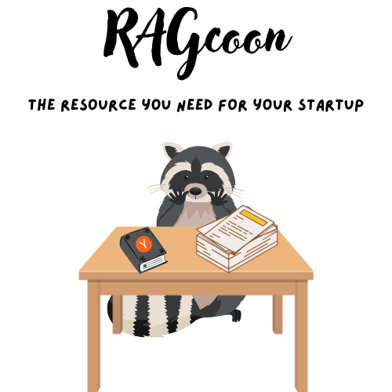
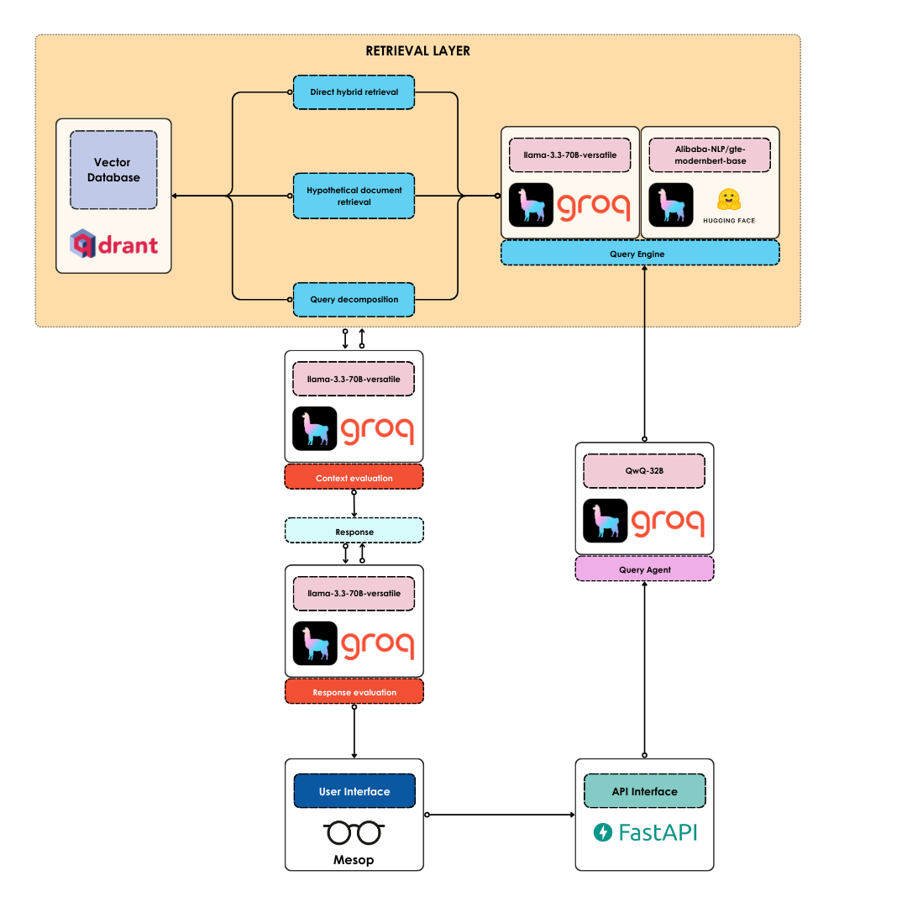

<h1 align="center">RAGcoon🦝</h1>

<h2 align="center">Agentic RAG to help you build your startup</h2>

<div align="center">
    <h3>If you find RAGcoon userful, please consider to donate and support the project:</h3>
    <a href="https://github.com/sponsors/AstraBert"></a>
</div>
<br>
<div align="center">
    
</div>

## Install and launch🚀

The first step, common to both the Docker and the source code setup approaches, is to clone the repository and access it:

```bash
git clone https://github.com/AstraBert/ragcoon.git
```
Once there, you can choose one of the two following approaches:

### Docker (recommended)🐋

> _Required: [Docker](https://docs.docker.com/desktop/) and [docker compose](https://docs.docker.com/compose/)_

- Add the `groq_api_key` in the [`.env.example`](.env.example)file and modify the name of the file to `.env`. Get this key:

    + [On Groq Console](https://console.groq.com/keys)

```bash
mv .env.example .env
```

- Launch the Docker application:

```bash
# If you are on Linux/macOS
bash start_services.sh
# If you are on Windows
.\start_services.ps1
```

Or, if you prefer:

```bash
docker compose up qdrant -d
docker compose up frontend -d
docker compose up backend -d
```

You will see the frontend application running on `http://localhost:8001`/ and you will be able to use it. Depending on your connection and on your hardware, the set up might take some time (up to 30 mins to set up) - but this is only for the first time your run it!

### Source code🖥️

> _Required: [Docker](https://docs.docker.com/desktop/), [docker compose](https://docs.docker.com/compose/) and [conda](https://anaconda.org/anaconda/conda)_

- Add the `groq_api_key` in the [`.env.example`](.env.example)file and modify the name of the file to `.env` in the `scripts` folder. Get this key:
    + [On Groq Console](https://console.groq.com/keys)

```bash
mv .env.example scripts/.env
```

- Set up RAGcoon using the dedicated script:

```bash
# For MacOs/Linux users
bash setup.sh
# For Windows users
.\setup.ps1
```

- Or you can do it manually, if you prefer:

```bash
docker compose up qdrant -d
conda env create -f environment.yml
conda activate ragcoon
```

- Now launch the frontend application

```bash
gunicorn frontend:me --bind 0.0.0.0:8001
```

- And then, from another terminal window, go into `scripts` and launch the backend:

```bash
uvicorn main:app --host 0.0.0.0 --port 8000
```

You will see the application running on `http://localhost:8001` and you will be able to use it.

## How it works



The main workflow is handled by a Query Agent, built upon the ReAct architecture. The agent exploits, as a base LLM, the latest reasoning model by Qwen, i.e. [`QwQ-32B`](https://console.groq.com/docs/model/qwen-qwq-32b), provisioned by [Groq](https://groq.com/).

1. The question coming from the frontend (developed with [Mesop](https://google.github.io/mesop/) - running on `http://localhost:8001`) is sent into a POST request to the [FastAPI](https://fastapi.tiangolo.com/)-managed API endpoint on `http://localhost:8000/chat`.
2. When the Agent is prompted with the user's question, it tries to retrieved relevant context routing the query to one of three query engines:
    - If the query is simple and specific, it goes for a direct hybrid retrieval, exploiting both a dense ([`Alibaba-NLP/gte-modernbert-base`](https://huggingface.co/Alibaba-NLP/gte-modernbert-base)) and a sparse ([`Qdrant/bm25`](https://huggingface.co/Qdrant/bm25)) retriever
    - If the query is general and vague, it first creates an hypothetical document, which is embedded and used for retrieval
    - If the query is complex and involves searching for nested information, the query is decomposed into several sub-queries, and the retrieval is performed for all of them, with a summarization step in the end
3. The agent evaluates the context using [`llama-3.3-70B-versatile`](https://github.com/meta-llama/llama-models/blob/main/models/llama3_3/MODEL_CARD.md), provisioned through Groq. If the context is deemed relevant, the Agent proceeds, otherwise it goes back to retrieval, trying a different method.
4. The agent produces a candidate answer
5. The agent evaluates the faithfulness and relevancy of the candidate response, in light of the retrieved context, using [LlamaIndex evaluation methods](https://docs.llamaindex.ai/en/stable/module_guides/evaluating/)
6. If the response is faithful and relevant, the agent returns the response, otherwise it gets back at generating a new one.
 
## Contributing

Contributions are always welcome! Follow the contributions guidelines reported [here](CONTRIBUTING.md).

## License and rights of usage

The software is provided under MIT [license](./LICENSE).
